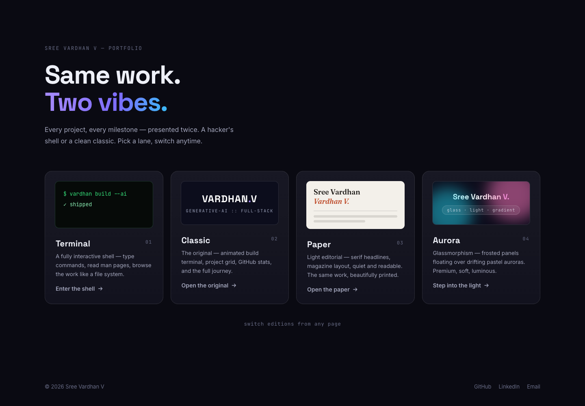

<div align="center">

# Sree Vardhan V — Portfolio

**Generative AI Developer & Full-Stack Developer**



[](https://vardhan-v-portfilo.vercel.app)
[](https://github.com/vardhan23v)
[](https://www.linkedin.com/in/vardhan-v23)

</div>

A premium, production-quality personal portfolio positioning me as a **Generative AI
Developer & Full-Stack Developer** — built around real AI-powered products, not a list of
technologies.

> *I build with AI. I ship with code.*

## ✨ Dual editions

The site opens on an **edition picker** — one portfolio, two skins, same real work:

- **`/terminal` — Terminal edition** — retro CRT/hacker theme: boot sequence,
  interactive command shell in the hero with ↑/↓ history, Tab completion and a
  `` ` `` global focus shortcut (`help`, `whoami`, `ls`, `cat about.txt`,
  `cat skills.tree`, `neofetch`, `cowsay`, `matrix`, `ping`…), work as
  `ls -l ./work/`, experience as a log, case studies as man pages at
  `/terminal/work/:slug`
- **`/classic` — Classic edition** — the original design: animated
  `vardhan build --ai` terminal, neural-network hero, project grid, GitHub stats,
  skills, education timeline and contact form

- **`/paper` — Paper edition** — light editorial: Fraunces serif headlines,
  magazine overlines, hairline rules, quiet and readable
- **`/aurora` — Aurora edition** — glassmorphism: frosted panels, drifting
  pastel aurora blobs, gradient text, premium and luminous

You can switch editions from any page.

## ✨ Highlights

- **Hero** — animated terminal (`$ vardhan build --ai` → `✓ shipped`) with neural-node glow
  and floating code chips
- **7 featured projects** — Extension AI, AI Code Reviewer, CareerForge Pro, Vard AI,
  DisasterMind AI, Campus Compass, DriveNest — each with the problem it solves, features,
  tech stack, GitHub + live demo links
- **"Other things I've built"** — 10 more projects in a compact grid
- **Experience timeline** — OxCode, FlyRank AI, Zetheta Algorithms, Zaalima Development
- **Tech stack** — glyph chips grouped by category (no fake percentage bars)
- **Building in Public** — live GitHub API stats + top repos, with a graceful static
  fallback if the API fails
- **Contact** — channels + mailto-fallback form (no fake backend)
- **SEO & a11y** — Open Graph/Twitter meta, sitemap, robots.txt, semantic HTML, skip link,
  focus states, `prefers-reduced-motion` support

## 🛠 Tech Stack

| Layer | Tools |
| --- | --- |
| Framework | Vite, React 19, TypeScript |
| Styling | Hand-written CSS with design tokens (zero UI libraries) |
| Animation | IntersectionObserver scroll reveals, pure CSS keyframes |
| Data | GitHub REST API (live "Building in Public" section) |
| Deployment | Vercel (auto-deploy on push) |

Bundle is ~73 kB gzipped — no icon libraries, no animation frameworks, no bloated deps.

## 📁 Structure

```
.
├── public/            # favicon, robots.txt, sitemap.xml, resume/ (drop resume.pdf here)
├── docs/              # README screenshots
└── src/
    ├── data/          # ALL content — projects, experience, skills, education, certs
    ├── components/    # one component per section + Navbar, Footer, Terminal
    ├── hooks/         # useReveal (scroll reveal)
    ├── lib/           # inline SVG icon set
    └── styles/        # global design system
```

## 🚀 Getting Started

```bash
npm install
npm run dev        # http://localhost:5173
npm run build      # production build → dist/
npm run preview    # preview the production build
```

## ✏️ Customizing Content

Everything on the site is **data-driven** — edit the files in `src/data/`:

| File | What it controls |
| --- | --- |
| `src/data/site.ts` | Name, title, links, resume path |
| `src/data/projects.ts` | Featured + other projects |
| `src/data/experience.ts` | Experience, education, certifications |
| `src/data/skills.ts` | Tech stack categories + "Currently Exploring" |

No component changes needed. Rebuild and push — Vercel deploys automatically.

## 📝 Before Launch

1. Drop your resume at `public/resume/resume.pdf`
2. Update `og:url` and `sitemap.xml` if you change domains
3. The GitHub section shows live stats; if the API is rate-limited it falls back to a
   static snapshot

## 🔗 Links

- **Live:** https://vardhan-v-portfilo.vercel.app
- **GitHub:** https://github.com/vardhan23v
- **LinkedIn:** https://www.linkedin.com/in/vardhan-v23
- **Email:** 23vvardhan@gmail.com

---

© Sree Vardhan V · Designed & built by me — no template involved.